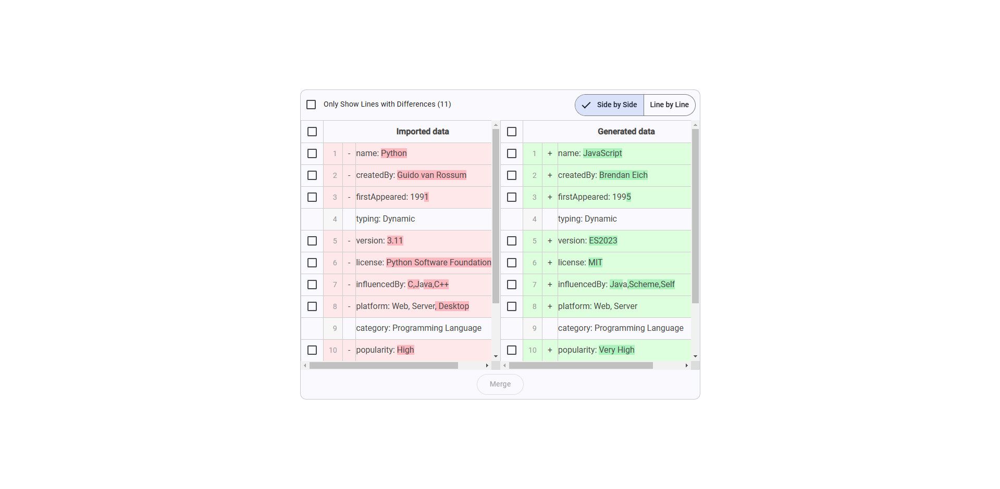
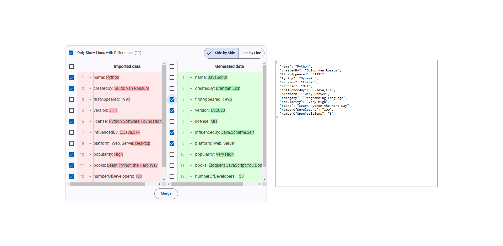

# :zap: Object Merger

* This app was generated with [Angular CLI](https://github.com/angular/angular-cli) version 19.0.6.

## :page_facing_up: Table of contents

* [:zap: Object Merger](#object-merger)
  * [:books: General info](#books-general-info)
  * [:camera: Screenshots](#camera-screenshots)
  * [:signal_strength: Technologies](#signal_strength-technologies)
  * [:floppy_disk: Setup](#floppy_disk-setup)
  * [:cool: Features](#cool-features)
  * [:clipboard: Status & To-Do List](#clipboard-status--to-do-list)
  <!-- * [:file_folder: License](#file_folder-license) -->
  * [:envelope: Contact](#envelope-contact)

## :books: General info

* Highlights the differences between two objects, allowing you to select and merge the desired information from each object.

## :camera: Screenshots

    
    

## :signal_strength: Technologies

* [Angular v19](https://angular.io/)
* [Angular Material](https://v19.material.angular.io/)
* [diff-match-patch](https://www.npmjs.com/package/diff-match-patch/)

## :floppy_disk: Setup

* git clone `https://github.com/ermalCerhozi/object-merger.git`.
* Install dependencies using `npm install`.
* Run `ng serve`.
* Navigate to `http://localhost:4200/`. The app will automatically reload if you change any of the source files.

## :cool: Features

* Side by side or line by line views.

## :clipboard: Status & To-Do List

* Status: Working.
* To-Do: Merge-right and Merge-left feature.

## :envelope: Contact

* Repo created by [Ermal Cerhozi](https://github.com/ermalCerhozi), email: ermal.cerhozi3@gmail.com